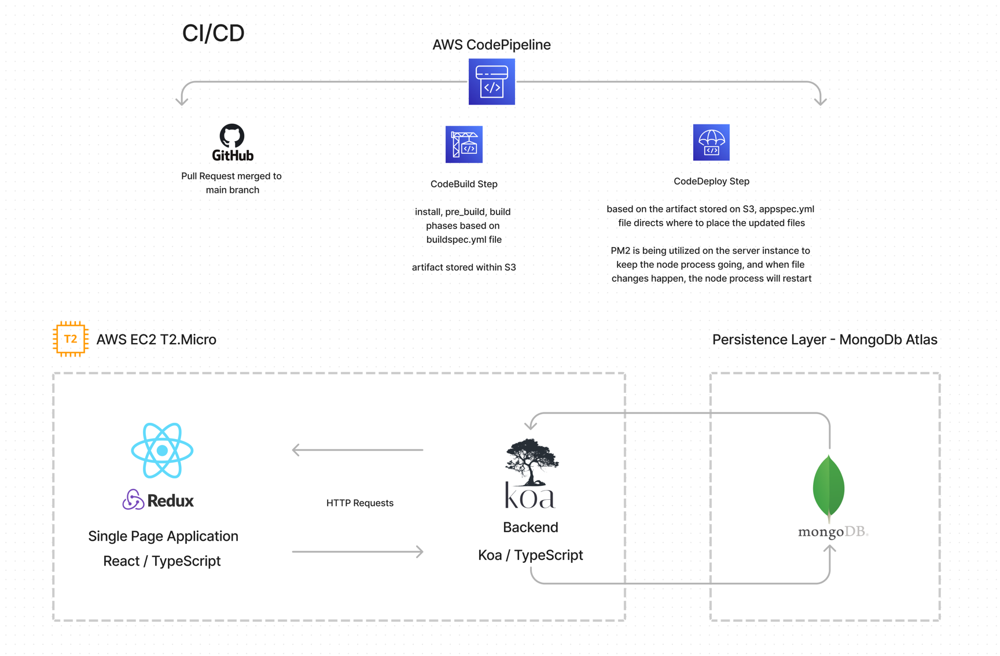

# Koa.js REST API for a Reading List
Provides CRUD functionality for creating reading lists. Integrates with the New York Times Books API.

## Tech Stack
- Typescript
- Node.js
- Koa
- MongoDB Atlas

At one point, I had this application deployed along with a CI/CD pipeline on AWS utilizing this architecture:
